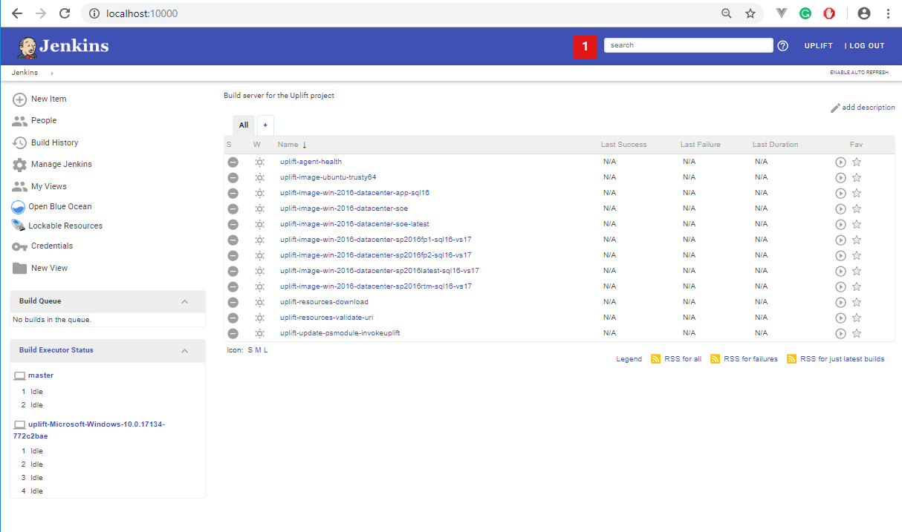

# uplift-cicd-jenkins2
This repository contains ready-to-use Jenkins server and pipelines to build uplift Packer images and Vagrant boxes.

The uplift project offers consistent Packer/Vagrant workflows and Vagrant boxes specifically designed for SharePoint professionals. It heavy lifts low-level details of the creation of domain controllers, SQL servers, SharePoint farms and Visual Studio installs by providing a codified workflow using Packer/Vagrant tooling.

## Build status
| Branch  | Status | 
| ------------- | ------------- |  
| master| [](https://ci.appveyor.com/project/SubPointSupport/uplift-cicd-jenkins2/branch/master) |  
| beta  | [](https://ci.appveyor.com/project/SubPointSupport/uplift-cicd-jenkins2/branch/beta)  | 
| dev   | [](https://ci.appveyor.com/project/SubPointSupport/uplift-cicd-jenkins2/branch/dev) | 

## How this works
The uplift project is split into several repositories to address particular a piece of functionality:

* [uplift-powershell](https://github.com/SubPointSolutions/uplift-powershell) - reusable PowerShell modules
* [uplift-packer](https://github.com/SubPointSolutions/uplift-packer) - Packer templates for SharePoint professionals
* [uplift-vagrant](https://github.com/SubPointSolutions/uplift-vagrant) - Vagrant plugin to simplify Windows infrastructure provisioning 
* [uplift-cicd-jenkins2](https://github.com/SubPointSolutions/uplift-cicd-jenkins2) - Jenkins server and pipelines to build uplift Packer images and Vagrant boxes

The current repository houses pre-configured Jenkins server, default pipelines and agents automation. Projects uses Vagrant box based on `ailispaw/barge` to run Docker container with Jenkins. Usage of vagrant makes this project portables - it can be run on Windows, MacOS, and even on Windows 2008.

## Using `uplift-cicd-jenkins2` project 
First of all, get the latest from the `master` or `dev` branches:

```powershell
git clone https://github.com/SubPointSolutions/uplift-cicd-jenkins2.git
cd uplift-cicd-jenkins2

git checkout dev
git status
```

The source code is organized into three parts:
* `server` - jenkins server config, Docker container and Vagrantfile
* `agent` - jenkins agent automation 
* `pipelines` - default pipeline and build automation

### Running jenkins server
Standing up a new jenkins server is super-easy. The server itself comes as a pre-configured Dockerfile based on official `jenkins/jenkins` image. To ensure cross-platform portability, a vagrant box based on `ailispaw/barge` is used to run Docker container. That way, the jenkins server can be run on Windows, MacOS and even Windows 2008 - anywhere where the Vagrant runs.

```powershell
cd server/jenkins2

vagrant status
vagrant up
```

Once up, vagrant box automatically build and runs docker container with jenkins server. Default configuration exposes jenkins on `http://localhost:10000` and stores data within the vagrant box. Further box reboots or provision persists jenkins data. Destorying box will clean up all jenkins data.

Forced vagrant provision with `--provision` flag triggers jenkins2 container rebuild. If container was changes, then automation will stop existing container and start a new container from fresher images. This makes sure that up-to-date jenkins container is run while the data is persisted within the vagrant box.

```powershell
# rebuild docker container
vagrant up --provision
```

Environment variables `DOCKER_NO_CACHE` can be set to trigger docker container rebuild with `--no-cache` flag.

Once `vagrant up` is completed, Jenkins should be available on `http://localhost:10000` with default user `uplift` and password `uplift`.

* server: `http://localhost:10000`
* user: `uplift`
* password: `uplift`
* default agent port: `50000`

## Configuring jenkins theme
Jenkins server comes with a bunch of plugins configured in `server\jenkins2\docker\plugins\plugins.txt` file. One of these plugins is `Jenkins Simple Theme Plugin` which provides easy theme management for jenkins.

It might be a good idea to set a custom Jenkins theme to distinguish Jenkins server instances. A fresh dev instance won't have any theme setup, whereas a long-running beta/master instance will have a distinct colour palette. It helps to differentiate and avoid ambiguity while working on several Jenkins instances.

There is a good project `jenkins-material-theme` which beautifies Jenkins with the Material Design theme and comes with dozen pre-configured colour.

* jenkins-material-theme - [http://afonsof.com/jenkins-material-theme](http://afonsof.com/jenkins-material-theme/)

Click `Manage Jenkins`, then `Configure System`, and add a new `CSS URL` under `Theme -> Theme elements`:
* https://cdn.rawgit.com/afonsof/jenkins-material-theme/gh-pages/dist/material-indigo.css
* https://cdn.rawgit.com/afonsof/jenkins-material-theme/gh-pages/dist/material-red.css
* https://cdn.rawgit.com/afonsof/jenkins-material-theme/gh-pages/dist/material-blue.css
* https://cdn.rawgit.com/afonsof/jenkins-material-theme/gh-pages/dist/material-light-blue.css

## Running jenkins agent
Standing up a new jenkins agent is also super-easy. Ready-to-use scripts can be found under `agents\scripts`. Automation uses [swarm plugin](https://wiki.jenkins.io/display/JENKINS/Swarm+Plugin) for agent auto-discovery.

* [https://wiki.jenkins.io/display/JENKINS/Swarm+Plugin](https://wiki.jenkins.io/display/JENKINS/Swarm+Plugin)

```powershell
cd agents\scripts

# show options
pwsh -f jenkins2-agent.ps1 

# start new jenkins agent
pwsh -f jenkins2-agent.ps1 register 
```

Agent automatically connects to `http://localhost:10000` using port `50000` for agent communication. A

Additionally, environment variable `JENKINS_FS_ROOT` can be used to setup non-default folder for build job. It comes handy to move temporary jobs folder off the system drive.

```powershell
# shell
SET "JENKINS_FS_ROOT=D:/_uplift_agent_data" && pwsh -f jenkins2-agent.ps1 register

# powershell
$env:JENKINS_JOB_FOLDER = "c:/_uplift_agent_data"
.\jenkins2-agent.ps1 register
```

## Populating jenkins jobs
`pipelines\jobs` folder contains ready-to-use jenkins pipeline to build packer templates for the uplift project. Additional automation is used to sync these job from the local folder with the active jenkins server. 

That way, Jenkins server is decoupled from the pipeline and pipeline provision. The server can be used for other scenarios, and the pipelines can be populated as the project needs - from local project folders or other repositories. Control over initial pipeline provision is fully externalised and does not depend on Jenkins itself.

All pipeline start with `uplift-` prefix and should not be modified. These are provides out of the box and can be changed without notice. It is encouraged to create your own custom pipelines as needed.

Two additional `npm` packages are needed:
```powershell
cd pipelines

npm install xml-escape 
npm install jenkins-api 
```

Once done, execute `sync-jobs.js` to populate jenkins2 jobs:

```powershell
cd pipelines
node sync-jobs.js
```

`JENKINS_JOB_FOLDER` and `JENKINS_URL` environment variables can be used to tweak default script behaviour:

```powershell
$env:JENKINS_JOB_FOLDER = "c:/my-custom-pipelines"
$env:JENKINS_URL = "http://192.168.2.50:10000"

node sync-jobs.js
```

Once done, jenkins will have default pipeline to build packer templates.




## Building packer templates
`uplift-cicd-jenkins2` project provides a jenkins server and build pipelines designed to build uplift packer templates. Please review documentation on [uplift-packer](https://github.com/subpointsolutions/uplift-packer) to see all available commands and option while building packer templates.

> !!! WARNING !!!
> 
> Please note that some of the build need external binaries. Review `uplift-packer` on how to build a local repository so that such packer images can be built.

## Jenkins pipeline examples
As mentioned, review documentation on [uplift-packer](https://github.com/subpointsolutions/uplift-packer) to see all available commands and option while building packer templates.

Below are several examples on how to build uplift packer templates under jenkins pipelines. 

### Agent health pipeline
```groovy
// checks that all software is installed on the agent
node('uplift') {

    stage('initial check') {
        sh 'whoami'
    }

    stage('build tools') {
        sh 'git version'
        sh 'pwsh -version'

        sh 'wget --version'
        sh 'curl --version'
    }

    stage('hashicorp tools') {
        sh 'packer version'
        sh 'vagrant version'
    }

    stage('virtualbox tooling') {
        sh 'vboxmanage --version'
    }
}

```

### Downloading binaries pipeline
```groovy
node('uplift') {

    // target repository folder
    def repoPath = "X:/uplift-local-repository"

    // this would take some time
    // pick and choose resources you need
    def resources = [
        "7z-",
        "hashicorp-",
        "jetbrains-",
        "ms-dynamics-",
        "ms-sharepoint2013-",
        "ms-sharepoint2016-",
        "ms-sharepoint-",
        "ms-sql-",
        "ms-visualstudio-2013",
        "ms-visualstudio-2015",
        "ms-visualstudio-2017.ent-installer",
        "ms-win2012r2-kb",
        "ms-win-2016-iso",
        "ms-win2016-lcu",
        "ms-win2016-ssu",
        "oracle-"
    ]

    stage('resource list') {
        sh "pwsh -c 'uplift resource list' "
    }

    resources.each {
        def resourceName = it

        stage("download ${resourceName}") {
            sh "pwsh -c 'uplift resource download ${resourceName} -r $repoPath -d' "
        }
    }
}
```

### Building `ubuntu-trusty64` image
```groovy
node('uplift') {

    def gitRepo          = "https://github.com/SubPointSolutions/uplift-packer.git"
    def workingDir       = "uplift-packer"
    def upliftWorkingDir =  workingDir;

    def imageName  = "ubuntu-trusty64"
    
    stage('Checkout') {
        sh "git clone $gitRepo || (cd $workingDir && git pull) "   
    }

    stage('packer rebuild') {
       sh "cd $upliftWorkingDir && pwsh -c 'invoke-build -packerImageName $imageName -Task PackerRebuild' "
    }
}
```

### Building `ubuntu-trusty64` image with custom parameters 
```groovy
node('uplift') {

    def gitRepo          = "https://github.com/SubPointSolutions/uplift-packer.git"
    def workingDir       = "uplift-packer"
    def upliftWorkingDir =  workingDir;

    def imageName  = "ubuntu-trusty64"
    
    // - UPLF_VBMANAGE_MACHINEFOLDER is used by vboxmanage to switch default VirtualBox VM folder
    // - TMPDIR/TMP is used by Packer as temporary folder for import/export 
    
    def machineFolder = "D:/__uplift_vm_build"
    def packerTmpDir  = "D:/__uplift_packer_tmp_dir"

    stage('Checkout') {
        sh "git clone $gitRepo || (cd $workingDir && git pull) "   
    }

    stage('packer rebuild') {
        withEnv([
                "UPLF_VBMANAGE_MACHINEFOLDER=$machineFolder",
                "TMPDIR=$packerTmpDir",
                "TMP=$packerTmpDir"
            ])  
        {
            sh "cd $upliftWorkingDir && pwsh -c 'invoke-build -packerImageName $imageName -Task PackerRebuild -UPLF_INPUT_BOX_NAME $inputBoxName' "
        }
    }
}
```

### Building `win-2016-datacenter-soe` image with custom ISO 
```groovy
node('uplift') {

    def gitRepo          = "https://github.com/SubPointSolutions/uplift-packer.git"
    def workingDir       = "uplift-packer"
    def upliftWorkingDir =  workingDir;

    def imageName     = "win-2016-datacenter-soe"
    
    // UPLF_ISO_URL is used to point to Windows ISO
    // packer won't download this iso image
    def isoUrl        = "$repoPath/ms-win-2016-iso-x64-eval/latest/14393.0.160715-1616.RS1_RELEASE_SERVER_EVAL_X64FRE_EN-US.iso"  

    stage('Checkout') {
        sh "git clone $gitRepo || (cd $workingDir && git pull) "   
    }

    stage('packer rebuild') {
        withEnv([
                "UPLF_VBMANAGE_MACHINEFOLDER=$machineFolder",
                "UPLF_ISO_URL=$isoUrl",
                "TMPDIR=$packerTmpDir",
                "TMP=$packerTmpDir"
            ])  
        {
            sh "cd $upliftWorkingDir && pwsh -c 'invoke-build -packerImageName $imageName -Task PackerRebuild' "
        }
    }
}
```


### Building `win-2016-datacenter-soe` image with custom ISO 
```groovy
node('uplift') {

    def gitRepo          = "https://github.com/SubPointSolutions/uplift-packer.git"
    def workingDir       = "uplift-packer"
    def upliftWorkingDir =  workingDir;

    def imageName     = "win-2016-datacenter-soe"
    
    // UPLF_ISO_URL is used to point to Windows ISO
    // packer won't download this iso image
    def isoUrl        = "$repoPath/ms-win-2016-iso-x64-eval/latest/14393.0.160715-1616.RS1_RELEASE_SERVER_EVAL_X64FRE_EN-US.iso"  

    stage('Checkout') {
        sh "git clone $gitRepo || (cd $workingDir && git pull) "   
    }

    stage('packer rebuild') {
        withEnv([
                "UPLF_VBMANAGE_MACHINEFOLDER=$machineFolder",
                "UPLF_ISO_URL=$isoUrl",
                "TMPDIR=$packerTmpDir",
                "TMP=$packerTmpDir"
            ])  
        {
            sh "cd $upliftWorkingDir && pwsh -c 'invoke-build -packerImageName $imageName -Task PackerRebuild' "
        }
    }
}
```

### Building `win-2016-datacenter-sp2016fp2-sql16-vs17` image
```groovy
node('uplift') {

    def gitRepo          = "https://github.com/SubPointSolutions/uplift-packer.git"
    def workingDir       = "uplift-packer"
    def upliftWorkingDir =  workingDir;

    def imageName     = "win-2016-datacenter-sp2016fp2-sql16-vs17"
    
    // UPLF_INPUT_BOX_NAME is used to pick the starting Vagrant box
    def inputBoxName  = "uplift-local/win-2016-datacenter-app-sql16-master"

    def machineFolder = "D:/__uplift_vm_build"
    def packerTmpDir  = "D:/__uplift_packer_tmp_dir"

    stage('Checkout') {
        sh "git clone $gitRepo || (cd $workingDir && git pull) "   
    }

    stage('packer rebuild') {
        withEnv([
                "UPLF_VBMANAGE_MACHINEFOLDER=$machineFolder",
                "TMPDIR=$packerTmpDir",
                "TMP=$packerTmpDir"
            ])  
        {
            sh "cd $upliftWorkingDir && pwsh -c 'invoke-build -packerImageName $imageName -Task PackerRebuild' -UPLF_INPUT_BOX_NAME $inputBoxName' "
        }
    }
}
```

## Feature requests, support and contributions
All contributions are welcome. If you have an idea, create [a new GitHub issue](https://github.com/SubPointSolutions/uplift-cicd-jenkins2/issues). Feel free to edit existing content and make a PR for this as well.